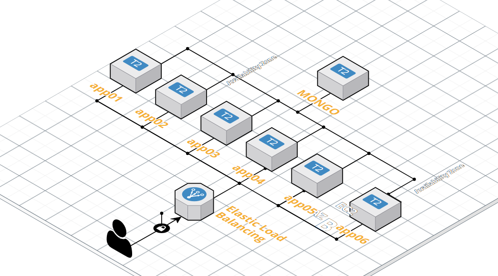

## Tecnologias Utilizadas
- Java 8, Maven , Spring Boot , Mongo, para test unitarios mockito para test de Integracion utilice Fongo como bd en memoria.

Ruta de la app deployada en el servidor aws : http://aplicacion-2092042095.us-east-1.elb.amazonaws.com

## EndPoints:

### POST /mutant/: 
Verifica si un ADN pertenece a un mutante o humano. Se deja registro en la DB Mongo si es que noi existe el registro previamente.

Ejemplo de Json de POST: {"dna": ["ATGCGA","CAGTGC","TTATGT","AGAAGG","CCCCTA","TCACTG"]}

Codigos de Respuesta POST /mutant/:

200 OK: Si el ADN resulta ser de un mutante.

403 FORFIDDEN: Si el ADN resulta ser de un humano.

400 BAD REQUEST: Si los componentes del ADN NO corresponden a: A,T,G y C.

400 BAD REQUEST: Si en el body se pasa un array que NO se pueda asociar a una matriz de NxN.

500 Internal Server Error.

### GET /stats/: 
Retorna estadísticas según los datos consultados (cant humanos, cant mutantes y ratio).

Ejemplo de llamada: http://aplicacion-2092042095.us-east-1.elb.amazonaws.com/stats/

### GET /healthCheck 
Salud de la aplicación. Respuesta 200 = si esta viva. Sirve para configurar las N instancias como Health Check

Ejemplo de llamada: http://aplicacion-2092042095.us-east-1.elb.amazonaws.com/healthCheck

### Testing

Opte por realizar test unitarios y adenas testing integrador en la clase MagnetoMutantApplicationTest levantando en memoria una DB Fongo para probar el correcto funcionamiento del programa desde los Controladores hasta los repositorios y DB.

### Deploy Entorno

Deje un  .bat o .sh (según su entorno) en el repositorio eso crea una instancia de esta aplicación.

Instalación en un entorno:
Es una app con spring boot cuenta con un tomcat embebido que escucha en el puerto 8080

Para el entorno productivo esta configurado el endPoin Porductivo se Ejecuta

java -jar -Dspring.profiles.active=prod Magneto-mutants-0.0.1-SNAPSHOT.jar

En cuanto a la estuctura de Servidor Productivo se configuro de la siguiente manera, Por tener una cuenta gratuita limitada Elegí la siguiente estructura 

